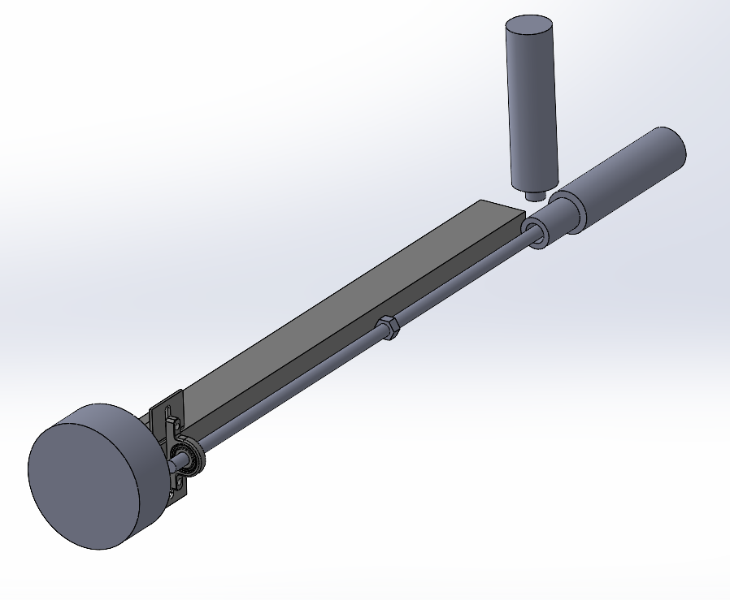

# me405_PenPlotterProject

## Project Description
###### For the ME 405 Term Project our team will build a 2.5 axis pen plotter. Our system uses a radial arm rotating arounda hub at which two Ametek-Pittman motors are located. 
###### One motor will contro lthe angular position of the plotter relative to the hub, and the other motor will connect to a lead screw to control the radial position of the pen. 
###### An additional solenoid will be implemented to turn the machine "on" and "off" by raising and lowering the pen. We will use a shaft coupling to connect the lead screw to the motor, on which an ACME nut moves linearly. 
###### The nut will attach to a custom 3D printed fixture which prevents the nut from rolling, and holds the pen. The fixture will slide freely along square tubiing parallel to the screw shaft. 

#### Bill of Materials 
###### Below is a bill of materials for major components of our system. 

| Qty. | Part                  | Source                | Est. Cost |
|:----:|:----------------------|:----------------------|:---------:|
|  2   | Pittperson Gearmotors | ME405 Tub             |     -     |
|  1   | Nucleo with Shoe      | ME405 Tub             |     -     |
|  1   | Purple Sharpie&trade; | Office Min&trade;     |   $1.02   |
|  1   | Hobby Servo     | Amazon             |   $5   |
|  1   | Rectangular Tubing        | McMaster-Carr | $8 |
|  1   | Lead Screw - 1/4-20 1/2" ACME        | McMaster-Carr | $15 |
|  1   | Shaft Coupling        | McMaster-Carr | $5 |
|  1   | Sleeve Nut        | McMaster-Carr | $5 |
|  1   | Pillow Block        | McMaster-Carr | $10 |
|  1   | Wood        | Teche Lab | - |

#### Scaled Sketch of Proposed System 

###### Above is  scaled sketch of our proposed system. 
